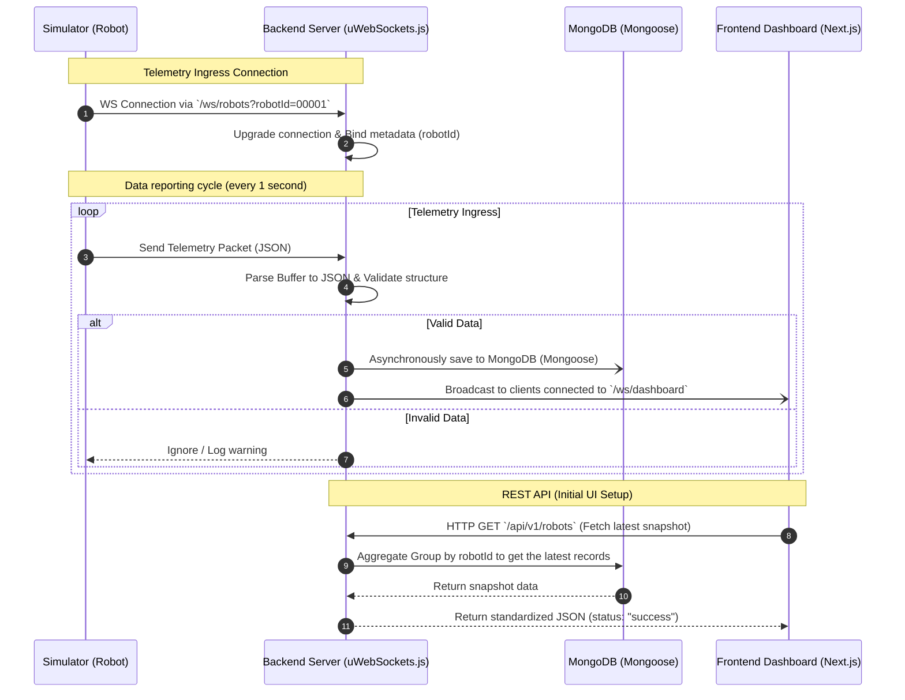

# 🤖 Robot Fleet Management Backend

The Backend source code is responsible for collecting real-time telemetry data from the Robot fleet via **WebSocket** connections, storing the data in **MongoDB**, and instantly broadcasting it to the **Next.js Dashboard Frontend**.

The system is built on **uWebSockets.js** - the fastest C++ networking library for Node.js, delivering microsecond latency and the ability to handle hundreds of thousands of concurrent connections.

---

## 🏗️ System Architecture & Data Flow

The system operates on a Real-time Closed-Loop Data Flow model:



### Processing Details:
1. **Ingress Connection:** The Simulator establishes a WebSocket connection to `/ws/robots` with the `robotId` Query Parameter.
2. **Upgrade Protocol:** The Backend catches the `upgrade` event, extracts the `robotId`, performs the handshake, and attaches the `robotId` metadata directly to the Socket object (`ws`).
3. **Ingress Data Processing:** Every second, the Robot sends a JSON packet containing telemetry metrics. The Backend receives the Buffer, decodes it to UTF-8 String, and validates it against a predefined schema.
4. **Persistence:** Valid data is asynchronously saved to MongoDB via the `RobotTelemetry` Mongoose Model. This non-blocking DB write ensures zero impact on transmission latency.
5. **Egress Broadcast:** Concurrently, the server iterates through connected dashboard clients (`/ws/dashboard`) and broadcasts the telemetry packet instantly.
6. **Initial State Loading (REST API):** Upon loading, the Frontend requests `/api/v1/robots`. The Backend queries MongoDB to fetch the latest telemetry record (Snapshot) for each Robot, drawing the initial UI before live WebSocket updates kick in.

---

## 📁 Detailed Directory Structure

```bash
backend/
├── constants/            # Static configurations & global constants
│   └── routes.js         # Centralized API routes and WebSocket paths
├── database/             # MongoDB database setup
│   ├── index.js          # Mongoose connection
│   └── models/           # Collection Schemas
│       └── RobotTelemetry.js # Robot telemetry data structure
├── routes/               # REST API Handlers (HTTP)
│   ├── index.js          # Centralized route registration
│   └── robots.js         # APIs for fetching Robot Snapshots and History
├── simulator/            # Robot telemetry simulator for Dev/Test
│   └── robot-simulator.js # Simulates 5 robots sending random data
├── utils/                # Reusable utility functions
│   ├── AppError.js       # Standardized error definitions (with status codes)
│   ├── asyncHandler.js   # Async wrapper to automatically catch errors
│   └── response.js       # Standardized JSON response formatting
├── validators/           # Data integrity checkers
│   └── telemetry.js      # Validator for incoming robot JSON payloads
├── websockets/           # Real-time processing core
│   ├── index.js          # Register and route main WebSocket connections
│   ├── clients.js        # Manages the list of connection objects
│   ├── robots.js         # Handles connections, upgrades, and robot messages
│   └── dashboard.js      # Manages Dashboard Frontend connections
├── .env.example          # Template for environment variables
├── app.js                # Main application entrypoint
├── cluster.js            # Cluster mode entrypoint for multi-core scaling
├── Dockerfile            # Docker image configuration
├── .dockerignore         # Docker ignore rules
├── package.json          # Dependencies and scripts
└── package-lock.json     # Dependency lockfile
```

---

## 🛠️ Setup & Execution (Dev Environment)

### 1. Prerequisites
- **Node.js**: LTS version 16, 18, or 20 (v18 or v20 recommended).
- **MongoDB**: Ensure MongoDB is running on the default port `localhost:27017` (or configure your own URI).

### 2. Install Dependencies
Navigate to the `backend` folder and install the required packages:
```bash
cd backend
npm install
```

### 3. Environment Configuration
Create an `.env` file based on `.env.example`:
```bash
cp .env.example .env
```
Default `.env` contents:
```ini
PORT=8080
MONGO_URI=mongodb://localhost:27017/robot-fleet
```

### 4. Start Backend Server (Dev Mode)
Start the server with `nodemon` to auto-restart on file changes:
```bash
npm run dev
```
Upon success, the terminal will log:
```text
🚀 Robot Fleet Server listening on port 8080
✅ Connected to MongoDB
```

### 5. Start Robot Simulator
To generate continuous telemetry data for UI testing, open another terminal and run the virtual robots:
```bash
npm run simulator
```
The simulator will instantiate 5 virtual robots (IDs `00001` to `00005`) that send randomized data every **1 second**.

---

## 📋 API Documentation

### 1. REST API (HTTP)
All successful HTTP responses return a standardized JSON format:
```json
{
  "status": "success",
  "data": ...,
  "timestamp": "2026-05-24T14:15:00.000Z"
}
```

*   **Get Latest Telemetry Snapshot of Entire Fleet**
    *   **Endpoint:** `/api/v1/robots`
    *   **Method:** `GET`
    *   **Description:** Retrieves the most recent telemetry state of all active robots.

*   **Get Telemetry History for a Specific Robot**
    *   **Endpoint:** `/api/v1/robots/:id/history`
    *   **Method:** `GET`
    *   **Query Parameters:** `hours` (Default: `6` - number of past hours to retrieve)
    *   **Description:** Retrieves a time-series list of data points to plot Battery and Temperature charts.

---

### 2. WebSocket Protocol

*   **Ingress (Input from Robots):**
    *   **URL:** `ws://localhost:8080/ws/robots?robotId={ROBOT_ID}`
    *   **Payload (JSON every 1s):**
        ```json
        {
          "batteryPercentage": 92.5,
          "wifiSignalStrength": -55,
          "isCharging": true,
          "temperature": 41.3,
          "memoryUsage": 28,
          "timestamp": "2026-05-24T14:09:11.000Z"
        }
        ```

*   **Egress (Broadcast to Dashboard):**
    *   **URL:** `ws://localhost:8080/ws/dashboard`
    *   **Payload (Real-time JSON):**
        ```json
        {
          "type": "telemetry",
          "data": { "robotId": "00001", "batteryPercentage": 92.5, "wifiSignalStrength": -55, "isCharging": true, "temperature": 41.3, "memoryUsage": 28, "timestamp": "2026-05-24T14:09:11.000Z" }
        }
        ```

## 💡 FAQ & Performance Optimization Architecture

**❓ Question:** Will the Simulator sending continuous data (every second) and the Backend writing continuously to the Database (MongoDB) cause an overload?

**✅ Answer & Solution:**
At a small scale, direct database inserts are fine. However, scaled up to thousands of robots, continuous `insert` operations will create a bottleneck in both Node.js and MongoDB.

To permanently solve this, the system is designed with a **2-part optimization combo:**

### 1. Application-Level Batch Insert (Node.js)
Instead of saving to the database upon every single robot message, the Backend uses a Memory Buffer:
- Raw WebSocket data is `push()`ed into the buffer.
- Utilizing `setInterval` every **5 seconds**, the Backend dumps the entire buffer into the database via a single `insertMany` command.
- **Benefit:** Drastically reduces CPU load for Node.js and minimizes Network I/O to the database.

### 2. Database-Level Time-Series Collection (MongoDB)
In tandem with batch inserts, the database structure is specialized:
- The `RobotTelemetry` schema enables the option: `{ timeseries: { timeField: 'timestamp', metaField: 'robotId' } }`.
- **Benefit:** MongoDB natively groups and compresses real-time data at the disk level. This saves up to 70% in storage space and dramatically accelerates queries when the Frontend needs to draw historical charts.

This combination of **Transport Optimization (Batch Insert)** and **Storage Optimization (Time-Series)** provides a robust, Enterprise-grade Backend architecture for IoT/Real-time systems.

---

## 🚀 Scaling the System with Cluster & Redis Pub/Sub

To handle tens of thousands of concurrent connections and maximize multi-core server resources, the system features a **Node.js Clustering** architecture combined with **Redis Pub/Sub**.

### 1. Multi-thread Architecture (Node.js Cluster)
- Instead of running a single process (worker) on 1 CPU core, `cluster.js` detects the number of server cores and forks that many worker processes.
- If a worker crashes, the Master process instantly detects it and spawns a replacement, ensuring **High Availability (HA)**.

### 2. Real-time Synchronization with Redis Pub/Sub
- Because each worker process has an isolated memory space, they don't natively know which users are connected to which worker.
- When a Robot sends Telemetry data to Worker A, Worker A doesn't broadcast it directly. Instead, it publishes a message to **Redis (Publish)**.
- All other Workers are listening to **Redis (Subscribe)**. Upon hearing the new data, each Worker broadcasts it down to its connected Dashboard clients.

### 3. Running Cluster Mode
To run the application with the Cluster (Production mode), you must have a **Redis Server** running locally (default port `6379`).

1. **Start Redis (via Docker):**
   ```bash
   docker run --name robot-redis -p 6379:6379 -d redis
   ```
2. **Start Backend Cluster:**
   Stop `npm run dev` and execute:
   ```bash
   npm run cluster
   ```

**❓ Question:** When running in Docker, the Backend throws `Error loading shared library ld-linux-x86-64.so.2` or `Failed to listen on port 8080` in Cluster mode. Why?

**✅ Answer & Solution:**
- **Missing `ld-linux...` library**: uWebSockets.js uses a precompiled C++ binary requiring `glibc`, but Docker `alpine` images use `musl` libc. Solution: change the base image in `Dockerfile` to a Debian-based one like `node:20-slim`.
- **Port 8080 EADDRINUSE in Cluster mode**: 
  - *Why?* In standard Node.js apps (like Express), the `cluster` module hijacks the native `net`/`http` module: the Master process binds to the port and passes connections to the Workers via IPC. However, **uWebSockets.js** is a native C++ addon that interfaces directly with the OS, bypassing Node's `net` module entirely. Thus, Node's `cluster` cannot intercept it. Each Worker tries to make a raw system call to bind port 8080 independently, resulting in an `EADDRINUSE` collision.
  - *Solution:* Instead of relying on the Node Master process, we leverage **SO_REUSEPORT** (a Linux kernel feature) to let the OS handle load balancing. By passing `0` as the options flag in the `listen()` function, uWebSockets.js instructs the Linux kernel to allow multiple Workers to bind to the same port: `app.listen(PORT, 0, (token) => {...})`.
