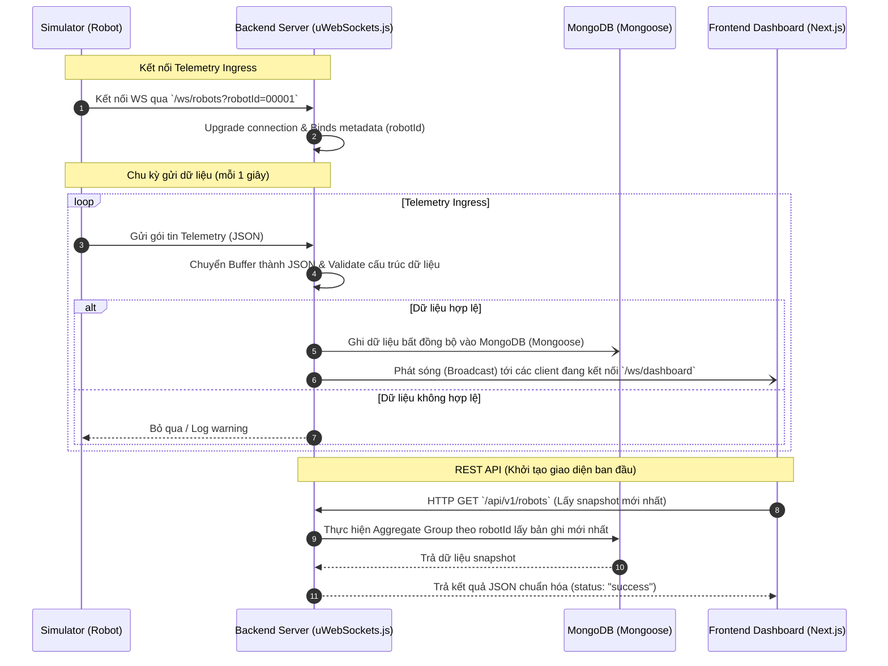

# 🤖 Robot Fleet Management Backend

Mã nguồn phía Backend chịu trách nhiệm thu thập dữ liệu viễn thông (telemetry) thời gian thực từ hạm đội Robot thông qua kết nối **WebSocket**, lưu trữ dữ liệu vào **MongoDB**, và phát sóng (broadcast) tức thời tới giao diện điều khiển **Dashboard Frontend Next.js**.

Hệ thống được xây dựng trên nền tảng **uWebSockets.js** - thư viện mạng viết bằng C++ cho Node.js nhanh nhất hiện nay, mang lại độ trễ cực thấp (microsecond) và khả năng chịu tải hàng trăm nghìn kết nối đồng thời.

---

## 🏗️ Kiến Trúc Hệ Thống & Luồng Hoạt Động (Data Flow)

Hệ thống hoạt động theo mô hình luồng dữ liệu khép kín thời gian thực (Real-time Closed-Loop Data Flow):



### Chi tiết luồng xử lý:
1. **Kết nối đầu vào (Ingress):** Simulator (giả lập robot) thiết lập kết nối WebSocket tới đường dẫn `/ws/robots` truyền kèm Query Parameter `robotId`.
2. **Xác thực kết nối (Upgrade Protocol):** Backend bắt sự kiện `upgrade`, trích xuất `robotId`, thực hiện xác thực giao thức bắt tay (handshake) và gắn metadata `robotId` trực tiếp vào đối tượng Socket (`ws`).
3. **Thu thập dữ liệu (Ingress Data Processing):** Định kỳ mỗi 1 giây, Robot gửi gói tin JSON chứa chỉ số telemetry (Pin, Nhiệt độ, RAM, Wifi, Trạng thái sạc). Backend tiếp nhận gói tin dưới dạng Buffer, giải mã sang UTF-8 String và thực hiện kiểm tra tính hợp lệ (Validation) qua schema định nghĩa sẵn.
4. **Lưu trữ dữ liệu (Persistence):** Dữ liệu hợp lệ được lưu bất đồng bộ vào cơ sở dữ liệu MongoDB qua Mongoose Model `RobotTelemetry`. Nhờ tính chất non-blocking, luồng ghi DB không làm ảnh hưởng đến độ trễ truyền tin.
5. **Truyền dữ liệu thời gian thực (Egress Broadcast):** Đồng thời, server duyệt qua danh sách các client (giao diện người dùng) đang mở kết nối ở cổng `/ws/dashboard` để gửi (broadcast) gói tin telemetry đó đi ngay lập tức.
6. **Yêu cầu REST API (Initial State Loading):** Khi người dùng mở trình duyệt, Frontend gửi yêu cầu HTTP GET tới `/api/v1/robots`. Backend truy vấn MongoDB (sử dụng MongoDB Aggregation Pipelines) để nhóm dữ liệu của từng Robot và lấy ra bản ghi viễn thông mới nhất (Snapshot) để vẽ giao diện ban đầu trước khi duy trì cập nhật bằng WebSocket.

---

## 📁 Cấu Trúc Thư Mục Chi Tiết

```bash
backend/
├── constants/            # Quản lý cấu hình tĩnh & các định nghĩa hằng số toàn hệ thống
│   └── routes.js         # Khai báo tập trung toàn bộ route API và đường dẫn WebSocket
├── database/             # Thiết lập cơ sở dữ liệu MongoDB
│   ├── index.js          # Kết nối DB sử dụng Mongoose
│   └── models/           # Nơi định nghĩa các bảng (Collection Schema)
│       └── RobotTelemetry.js # Cấu trúc dữ liệu ghi nhận của Robot
├── routes/               # Xử lý các REST API (Giao thức HTTP)
│   ├── index.js          # Nơi đăng ký tập trung tất cả các Route Class
│   └── robots.js         # Triển khai các API lấy Snapshot và Lịch sử của Robot
├── simulator/            # Bộ giả lập viễn thông robot phục vụ môi trường Dev/Test
│   └── robot-simulator.js # Lập lịch giả lập 5 robot gửi dữ liệu ngẫu nhiên ngắt quãng
├── utils/                # Các hàm tiện ích tái sử dụng toàn hệ thống
│   ├── AppError.js       # Khung định nghĩa lỗi chuẩn hóa (chứa status code)
│   ├── asyncHandler.js   # Wrapper hàm async tự động bắt lỗi (catch error)
│   └── response.js       # Chuẩn hóa định dạng JSON phản hồi đầu ra (success/error)
├── validators/           # Bộ kiểm tra tính toàn vẹn của dữ liệu
│   └── telemetry.js      # Validator cấu trúc JSON nhận được từ robot
├── websockets/           # Trọng tâm xử lý thời gian thực
│   ├── index.js          # Đăng ký và phân luồng kết nối WebSocket chính
│   ├── clients.js        # Đối tượng quản lý danh sách connection (dashboardClients)
│   ├── robots.js         # Xử lý kết nối, nâng cấp giao thức, nhận tin nhắn từ robot
│   └── dashboard.js      # Quản lý danh sách kết nối của các Dashboard Frontend
├── .env.example          # Tệp cấu hình các biến môi trường mẫu
├── app.js                # Tệp tin khởi chạy ứng dụng chính (Entrypoint)
├── package.json          # Quản lý thư viện cài đặt và các lệnh chạy dự án
└── package-lock.json     # Khóa phiên bản chi tiết của dependencies
```

---

## 🛠️ Cài Đặt & Chạy Môi Trường Phát Triển (Setup & Execution)

### 1. Yêu cầu hệ thống (Prerequisites)
- **Node.js**: Phiên bản LTS 16, 18 hoặc 20 (khuyến nghị v18 hoặc v20).
- **MongoDB**: Đảm bảo cơ sở dữ liệu MongoDB đang chạy ở cổng mặc định `localhost:27017` (hoặc cấu hình URI riêng).

### 2. Cài đặt Dependencies
Di chuyển vào thư mục `backend` và cài đặt các gói thư viện cần thiết:
```bash
cd backend
npm install
```

### 3. Cấu hình biến môi trường
Tạo file `.env` dựa trên file mẫu `.env.example`:
```bash
cp .env.example .env
```
Nội dung file `.env` mặc định:
```ini
PORT=8080
MONGO_URI=mongodb://localhost:27017/robot-fleet
```

### 4. Khởi động Backend Server (Dev Mode)
Lệnh này sẽ khởi chạy máy chủ cùng công cụ `nodemon` tự động khởi động lại server mỗi khi bạn lưu thay đổi mã nguồn:
```bash
npm run dev
```
Khi chạy thành công, terminal sẽ in ra:
```text
🚀 Robot Fleet Server listening on port 8080
✅ Connected to MongoDB
```

### 5. Khởi động Robot Simulator (Giả lập)
Để có dữ liệu viễn thông đổ về liên tục phục vụ cho việc kiểm thử UI của Dashboard, hãy mở thêm một terminal khác và khởi chạy robot ảo:
```bash
npm run simulator
```
Bộ giả lập sẽ tự động khởi tạo 5 robot ảo (mã định danh từ `00001` tới `00005`) gửi dữ liệu ngẫu nhiên mỗi **1 giây** với cấu hình kết nối chuẩn hóa.

---

## 📋 Tài Liệu API Chi Tiết (API Documentation)

### 1. REST API (Cổng HTTP)
Toàn bộ phản hồi HTTP thành công đều trả về dưới dạng JSON đồng nhất:
```json
{
  "status": "success",
  "data": ...,
  "timestamp": "2026-05-24T14:15:00.000Z"
}
```

*   **Lấy Snapshot Viễn Thông Mới Nhất Của Toàn Bộ Fleet**
    *   **Endpoint:** `/api/v1/robots`
    *   **Method:** `GET`
    *   **Ý nghĩa:** Truy vấn lấy ra trạng thái telemetry mới nhất của tất cả các robot đang hoạt động.
    *   **Ví dụ kết quả:**
        ```json
        {
          "status": "success",
          "data": [
            {
              "robotId": "00001",
              "batteryPercentage": 85.5,
              "wifiSignalStrength": -62,
              "isCharging": false,
              "temperature": 45.2,
              "memoryUsage": 32,
              "timestamp": "2026-05-24T14:09:12.314Z"
            }
          ],
          "timestamp": "2026-05-24T14:09:15.000Z"
        }
        ```

*   **Lấy Lịch Sử Viễn Thông Của Một Robot**
    *   **Endpoint:** `/api/v1/robots/:id/history`
    *   **Method:** `GET`
    *   **Query Parameters:** `hours` (Mặc định: `6` - số giờ muốn lấy lịch sử về trước)
    *   **Ý nghĩa:** Lấy danh sách chuỗi thời gian dữ liệu để vẽ biểu đồ diễn tiến Pin, Nhiệt độ cho robot cụ thể.
    *   **Ví dụ kết quả:** `/api/v1/robots/00001/history?hours=1`

---

### 2. Giao Thức WebSocket

*   **Ingress (Đầu vào từ Robot):**
    *   **URL:** `ws://localhost:8080/ws/robots?robotId={ROBOT_ID}`
    *   **Gói tin gửi lên (JSON mỗi 1 giây):**
        ```json
        {
          "batteryPercentage": 92.5,
          "wifiSignalStrength": -55,
          "isCharging": true,
          "temperature": 41.3,
          "memoryUsage": 28,
          "timestamp": "2026-05-24T14:09:11.000Z"
        }
        ```

*   **Egress (Đầu ra phát sóng tới Dashboard):**
    *   **URL:** `ws://localhost:8080/ws/dashboard`
    *   **Gói tin nhận về (JSON thời gian thực):**
        ```json
        {
          "type": "telemetry",
          "data": {
            "robotId": "00001",
            "batteryPercentage": 92.5,
            "wifiSignalStrength": -55,
            "isCharging": true,
            "temperature": 41.3,
            "memoryUsage": 28,
            "timestamp": "2026-05-24T14:09:11.000Z"
          }
        }
        ```

## 💡 FAQ & Kiến trúc tối ưu hóa (Performance Optimization)

**❓ Câu hỏi:** Việc Simulator liên tục gửi dữ liệu (mỗi giây) và Backend ghi liên tục vào Database (MongoDB) thì có gây quá tải không?

**✅ Trả lời & Giải pháp:**
Với quy mô nhỏ (vài con robot) thì việc ghi trực tiếp từng dòng dữ liệu vào DB không thành vấn đề. Tuy nhiên, nếu hệ thống mở rộng lên hàng nghìn robot, việc ghi dữ liệu liên tục (`insert` từng bản ghi) sẽ tạo ra "cổ chai" (bottleneck) ở cả Node.js và MongoDB. 

Để giải quyết triệt để bài toán này, hệ thống đã được thiết kế áp dụng **combo 2 tuyệt chiêu tối ưu hóa:**

### 1. Batch Insert ở tầng Ứng dụng (Node.js)
Thay vì mỗi lần nhận được dữ liệu từ 1 con robot là lưu ngay vào Database, Backend sử dụng một "Giỏ hàng" (Memory Buffer) để hứng dữ liệu:
- Dữ liệu thô từ WebSocket được `push()` vào giỏ hàng.
- Sử dụng `setInterval` để định kỳ **5 giây 1 lần**, Backend sẽ mang toàn bộ giỏ hàng đi cất vào Database cùng một lúc bằng lệnh `insertMany`.
- **Lợi ích:** Giảm tải cực lớn cho CPU của Node.js, giảm đáng kể số lượng kết nối mạng (Network I/O) tới Database. (Giống như shipper chở 1 chiếc xe tải 1000 món đồ thay vì chạy 1000 chuyến xe máy).

### 2. Time-Series Collection ở tầng Database (MongoDB)
Song song với việc gom cục dữ liệu, cấu trúc Database cũng được cấu hình chuyên biệt:
- Schema của `RobotTelemetry` được kích hoạt tùy chọn `{ timeseries: { timeField: 'timestamp', metaField: 'robotId' } }`.
- **Lợi ích:** MongoDB sẽ tự động gom nhóm, nén dữ liệu theo thời gian thực ở dưới tầng đĩa cứng. Việc này giúp tiết kiệm đến 70% dung lượng ổ cứng, đồng thời tăng tốc độ truy vấn lên gấp nhiều lần khi Frontend cần vẽ biểu đồ lịch sử. (Giống như nhà kho dùng kệ xếp đồ thông minh).

Sự kết hợp giữa **Tối ưu Vận chuyển (Batch Insert)** và **Tối ưu Lưu trữ (Time-Series)** tạo nên một kiến trúc Backend vững chắc, chuẩn Enterprise dành cho các hệ thống IoT/Real-time.

---

## 🚀 Mở rộng Hệ Thống (Scaling) với Cluster & Redis Pub/Sub

Để đáp ứng hàng chục nghìn kết nối đồng thời và tận dụng tối đa tài nguyên máy chủ nhiều nhân (Multi-core CPU), hệ thống đã được nâng cấp với kiến trúc **Node.js Clustering** kết hợp **Redis Pub/Sub**.

### 1. Kiến trúc Đa luồng (Node.js Cluster)
- Thay vì chạy một process (worker) duy nhất trên 1 core CPU, file `cluster.js` sẽ tự động đếm số lượng core của máy chủ và nhân bản (fork) ra bấy nhiêu worker process.
- Nếu một worker bị lỗi hoặc sập (crash), Master process sẽ lập tức phát hiện và khởi động lại một worker mới thay thế, đảm bảo **High Availability (HA)**.

### 2. Đồng bộ Realtime với Redis Pub/Sub
- Vì mỗi worker process có không gian bộ nhớ (memory) hoàn toàn độc lập, chúng không thể tự biết user nào đang kết nối ở worker nào.
- Khi Robot gửi dữ liệu Telemetry lên Worker A, Worker A sẽ không gửi trực tiếp cho Dashboard. Thay vào đó, nó sẽ phát tin nhắn lên **Redis (Publish)**.
- Tất cả các Worker còn lại đều đang lắng nghe **Redis (Subscribe)**. Khi nghe thấy có dữ liệu mới, mỗi Worker sẽ tự động truyền dữ liệu đó xuống cho các client Dashboard đang kết nối với mình.

### 3. Hướng dẫn Chạy Chế độ Cluster
Để chạy ứng dụng với cụm Cluster (chế độ Production), bạn cần có **Redis Server** đang chạy trên máy (cổng mặc định `6379`).

1. **Khởi chạy Redis (Nếu dùng Docker):**
   ```bash
   docker run --name robot-redis -p 6379:6379 -d redis
   ```
2. **Khởi chạy Backend Cluster:**
   Dừng lệnh `npm run dev` (nếu đang chạy) và sử dụng:
   ```bash
   npm run cluster
   ```
   *Terminal sẽ log ra thông báo khởi tạo số lượng worker tương ứng với CPU của bạn và xác nhận kết nối thành công tới Redis.*

**❓ Câu hỏi:** Khi chạy bằng Docker, Backend báo lỗi `Error loading shared library ld-linux-x86-64.so.2` hoặc lỗi `Failed to listen on port 8080` khi dùng Cluster. Vì sao vậy?

**✅ Trả lời & Giải pháp:**
- **Lỗi thiếu file `ld-linux...`**: Xảy ra do uWebSockets.js chứa lõi C++ cần thư viện chuẩn `glibc` của Linux, trong khi bản Node Docker `alpine` dùng `musl` libc rút gọn. Giải pháp là đổi base image trong `Dockerfile` sang bản Debian như `node:20-slim`.
- **Lỗi Port đụng độ khi chạy Cluster**: Do uWebSockets.js can thiệp sâu vào hệ điều hành nên không tương thích với cơ chế chia sẻ cổng tự động của Node.js Cluster. Giải pháp là bật tính năng **SO_REUSEPORT** của Linux bằng cách truyền tham số `0` vào hàm `listen()`: `app.listen(PORT, 0, (token) => {...})`.
